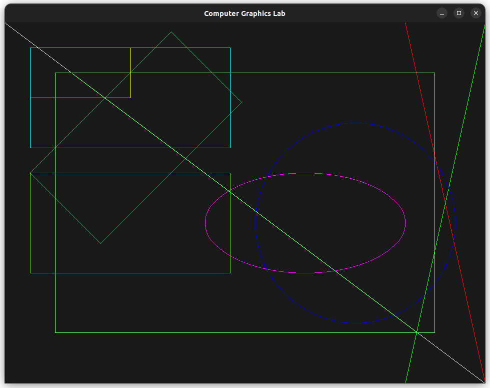
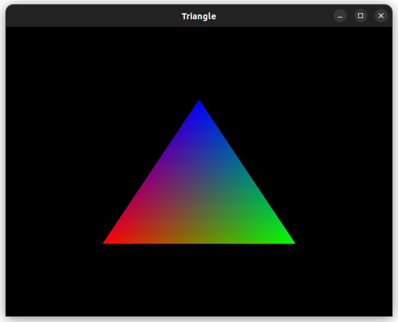
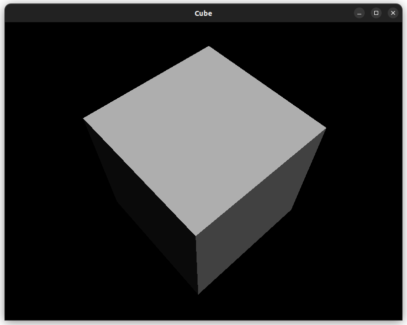

# COMPUTER GRAPHICS LAB BEI II/II

Codes written in SDL2 during Computer Graphics lab of BEI II/II in 2024 (2080 BS).
Also, OpenGL code using GLUT are added.

## Algorithms
1. Digital Differential ALgorithm
2. Bresenham's Line Drawing Algorithm
3. Mid-point Circle Drawing Algorithm
4. Mid-point Ellipse Drawing Algorithm
5. 2D-Transformation (Scaling, Translation, Rotation)
6. Cohen–Sutherland Line Clipping Algorithm
7. Liang-Barsky Line Clipping Algorithm

## How to use it?
I have provided files in `.hpp` and `.cpp` format. In order to use the algorithms and use the functions defined in these files in your own code. `lab.cpp` is there as an `example code`. Also, `OpenGL` codes are inside `opengl` folder.

## Build and Run lab.cpp
Using cmake:
```bash
mkdir build # make build directory
cd build # Enter into build
cmake .. # Compile cmake files
make -j8 # build project
make run # run project
```
Using Makefile (bash or powershell):
```bash
make -j8 # build
./build/graphics # run
```

<!-- Screen shot of lab.cpp --> 


## Build and Run OpenGL Examples
```bash
cd opengl
make -j8
./build/triangle
./build/cube
```

<!-- Output Screenshots -->

